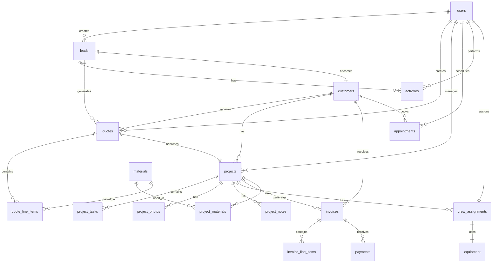

# Database Schema Documentation

## Overview

This document defines the complete database schema for the Ripple Roofs admin system. All tables use PostgreSQL and include Row Level Security (RLS) policies.

## Schema Design Principles

1. **Normalized Structure**: Minimize data duplication
2. **Foreign Key Integrity**: Enforce relationships
3. **Audit Trails**: Track all changes (created_at, updated_at)
4. **Soft Deletes**: Use deleted_at instead of hard deletes
5. **UUID Primary Keys**: Better for distributed systems
6. **Indexed Queries**: All foreign keys and common queries indexed

## Entity Relationship Diagram



## Core Tables

### 1. users (extends Supabase auth.users)

Stores additional user profile information beyond Supabase's built-in auth.

```sql
CREATE TABLE public.users (
  id UUID PRIMARY KEY REFERENCES auth.users(id) ON DELETE CASCADE,
  email TEXT UNIQUE NOT NULL,
  full_name TEXT NOT NULL,
  phone TEXT,
  role TEXT NOT NULL DEFAULT 'customer',
  avatar_url TEXT,
  created_at TIMESTAMPTZ NOT NULL DEFAULT NOW(),
  updated_at TIMESTAMPTZ NOT NULL DEFAULT NOW(),
  deleted_at TIMESTAMPTZ,
  
  -- Role constraints
  CONSTRAINT role_check CHECK (role IN (
    'super_admin',
    'admin', 
    'manager',
    'crew_lead',
    'crew_member',
    'customer'
  ))
);

-- Indexes
CREATE INDEX idx_users_role ON users(role) WHERE deleted_at IS NULL;
CREATE INDEX idx_users_email ON users(email) WHERE deleted_at IS NULL;

-- RLS Policies
ALTER TABLE users ENABLE ROW LEVEL SECURITY;

CREATE POLICY "Users can view their own profile"
  ON users FOR SELECT
  USING (auth.uid() = id);

CREATE POLICY "Admins can view all users"
  ON users FOR SELECT
  USING (
    EXISTS (
      SELECT 1 FROM users
      WHERE id = auth.uid()
      AND role IN ('super_admin', 'admin', 'manager')
      AND deleted_at IS NULL
    )
  );

CREATE POLICY "Super admins can manage users"
  ON users FOR ALL
  USING (
    EXISTS (
      SELECT 1 FROM users
      WHERE id = auth.uid()
      AND role = 'super_admin'
      AND deleted_at IS NULL
    )
  );
```

### 2. customers

Stores customer information separate from leads.

```sql
CREATE TABLE public.customers (
  id UUID PRIMARY KEY DEFAULT gen_random_uuid(),
  lead_id UUID REFERENCES leads(id),
  email TEXT UNIQUE NOT NULL,
  full_name TEXT NOT NULL,
  phone TEXT NOT NULL,
  address TEXT NOT NULL,
  city TEXT NOT NULL,
  state TEXT NOT NULL DEFAULT 'TX',
  zip TEXT NOT NULL,
  
  -- Property details
  property_type TEXT, -- 'residential', 'commercial'
  roof_type TEXT,
  roof_age INTEGER,
  square_footage INTEGER,
  
  -- Communication preferences
  preferred_contact_method TEXT DEFAULT 'email', -- 'email', 'phone', 'sms'
  email_opt_in BOOLEAN DEFAULT true,
  sms_opt_in BOOLEAN DEFAULT false,
  
  -- Customer lifecycle
  customer_since DATE NOT NULL DEFAULT CURRENT_DATE,
  lifetime_value DECIMAL(10,2) DEFAULT 0,
  total_projects INTEGER DEFAULT 0,
  
  -- Notes
  notes TEXT,
  
  -- Metadata
  created_by UUID REFERENCES users(id),
  created_at TIMESTAMPTZ NOT NULL DEFAULT NOW(),
  updated_at TIMESTAMPTZ NOT NULL DEFAULT NOW(),
  deleted_at TIMESTAMPTZ
);

-- Indexes
CREATE INDEX idx_customers_email ON customers(email) WHERE deleted_at IS NULL;
CREATE INDEX idx_customers_phone ON customers(phone) WHERE deleted_at IS NULL;
CREATE INDEX idx_customers_city ON customers(city) WHERE deleted_at IS NULL;
CREATE INDEX idx_customers_created_at ON customers(created_at) WHERE deleted_at IS NULL;

-- RLS Policies
ALTER TABLE customers ENABLE ROW LEVEL SECURITY;

CREATE POLICY "Admins can view all customers"
  ON customers FOR SELECT
  USING (
    EXISTS (
      SELECT 1 FROM users
      WHERE id = auth.uid()
      AND role IN ('super_admin', 'admin', 'manager')
      AND deleted_at IS NULL
    )
  );

CREATE POLICY "Admins can manage customers"
  ON customers FOR ALL
  USING (
    EXISTS (
      SELECT 1 FROM users
      WHERE id = auth.uid()
      AND role IN ('super_admin', 'admin')
      AND deleted_at IS NULL
    )
  );
```

### 3. leads

Tracks potential customers from initial contact through conversion.

```sql
CREATE TABLE public.leads (
  id UUID PRIMARY KEY DEFAULT gen_random_uuid(),
  
  -- Contact information
  full_name TEXT NOT NULL,
  email TEXT NOT NULL,
  phone TEXT NOT NULL,
  address TEXT,
  city TEXT,
  state TEXT DEFAULT 'TX',
  zip TEXT,
  
  -- Lead details
  source TEXT NOT NULL, -- 'website', 'google_ads', 'facebook', 'referral', 'phone', 'walk_in'
  service_type TEXT NOT NULL, -- 'repair', 'replacement', 'inspection', 'emergency'
  urgency TEXT NOT NULL DEFAULT 'medium', -- 'low', 'medium', 'high', 'emergency'
  status TEXT NOT NULL DEFAULT 'new', -- 'new', 'contacted', 'qualified', 'quoted', 'won', 'lost'
  
  -- Project details
  description TEXT,
  estimated_budget DECIMAL(10,2),
  preferred_start_date DATE,
  
  -- Lead scoring
  score INTEGER DEFAULT 0, -- 0-100
  quality TEXT DEFAULT 'unqualified', -- 'unqualified', 'poor', 'good', 'excellent'
  
  -- Assignment
  assigned_to UUID REFERENCES users(id),
  
  -- Conversion tracking
  converted_to_customer BOOLEAN DEFAULT false,
  converted_at TIMESTAMPTZ,
  lost_reason TEXT,
  lost_at TIMESTAMPTZ,
  
  -- Metadata
  created_by UUID REFERENCES users(id),
  created_at TIMESTAMPTZ NOT NULL DEFAULT NOW(),
  updated_at TIMESTAMPTZ NOT NULL DEFAULT NOW(),
  deleted_at TIMESTAMPTZ,
  
  -- Constraints
  CONSTRAINT source_check CHECK (source IN (
    'website', 'google_ads', 'facebook', 'referral', 
    'phone', 'walk_in', 'email', 'seo', 'other'
  )),
  CONSTRAINT service_type_check CHECK (service_type IN (
    'repair', 'replacement', 'inspection', 'maintenance', 
    'emergency', 'consultation', 'warranty'
  )),
  CONSTRAINT urgency_check CHECK (urgency IN (
    'low', 'medium', 'high', 'emergency'
  )),
  CONSTRAINT status_check CHECK (status IN (
    'new', 'contacted', 'qualified', 'quoted', 'won', 'lost', 'dead'
  )),
  CONSTRAINT quality_check CHECK (quality IN (
    'unqualified', 'poor', 'good', 'excellent'
  ))
);

-- Indexes
CREATE INDEX idx_leads_status ON leads(status) WHERE deleted_at IS NULL;
CREATE INDEX idx_leads_assigned_to ON leads(assigned_to) WHERE deleted_at IS NULL;
CREATE INDEX idx_leads_source ON leads(source) WHERE deleted_at IS NULL;
CREATE INDEX idx_leads_created_at ON leads(created_at DESC) WHERE deleted_at IS NULL;
CREATE INDEX idx_leads_city ON leads(city) WHERE deleted_at IS NULL;

-- RLS Policies
ALTER TABLE leads ENABLE ROW LEVEL SECURITY;

CREATE POLICY "Admins can view all leads"
  ON leads FOR SELECT
  USING (
    EXISTS (
      SELECT 1 FROM users
      WHERE id = auth.uid()
      AND role IN ('super_admin', 'admin', 'manager')
      AND deleted_at IS NULL
    )
  );

CREATE POLICY "Users can view assigned leads"
  ON leads FOR SELECT
  USING (assigned_to = auth.uid());

CREATE POLICY "Admins can manage leads"
  ON leads FOR ALL
  USING (
    EXISTS (
      SELECT 1 FROM users
      WHERE id = auth.uid()
      AND role IN ('super_admin', 'admin')
      AND deleted_at IS NULL
    )
  );
```

### 4. activities

Tracks all interactions with leads and customers.

```sql
CREATE TABLE public.activities (
  id UUID PRIMARY KEY DEFAULT gen_random_uuid(),
  
  -- Related entities
  lead_id UUID REFERENCES leads(id),
  customer_id UUID REFERENCES customers(id),
  project_id UUID REFERENCES projects(id),
  quote_id UUID REFERENCES quotes(id),
  
  -- Activity details
  type TEXT NOT NULL, -- 'call', 'email', 'sms', 'meeting', 'note', 'quote_sent', 'follow_up'
  subject TEXT NOT NULL,
  description TEXT,
  outcome TEXT, -- 'positive', 'neutral', 'negative', 'no_answer'
  
  -- Scheduling
  scheduled_at TIMESTAMPTZ,
  completed_at TIMESTAMPTZ,
  duration_minutes INTEGER,
  
  -- Assignment
  assigned_to UUID REFERENCES users(id) NOT NULL,
  
  -- Follow-up
  requires_follow_up BOOLEAN DEFAULT false,
  follow_up_date DATE,
  
  -- Metadata
  created_by UUID REFERENCES users(id) NOT NULL,
  created_at TIMESTAMPTZ NOT NULL DEFAULT NOW(),
  updated_at TIMESTAMPTZ NOT NULL DEFAULT NOW(),
  deleted_at TIMESTAMPTZ,
  
  -- Constraints
  CONSTRAINT type_check CHECK (type IN (
    'call', 'email', 'sms', 'meeting', 'note', 
    'quote_sent', 'follow_up', 'site_visit', 'inspection'
  )),
  CONSTRAINT outcome_check CHECK (outcome IN (
    'positive', 'neutral', 'negative', 'no_answer', 
    'callback_requested', 'completed'
  )),
  CONSTRAINT at_least_one_relation CHECK (
    lead_id IS NOT NULL OR 
    customer_id IS NOT NULL OR 
    project_id IS NOT NULL OR 
    quote_id IS NOT NULL
  )
);

-- Indexes
CREATE INDEX idx_activities_lead_id ON activities(lead_id) WHERE deleted_at IS NULL;
CREATE INDEX idx_activities_customer_id ON activities(customer_id) WHERE deleted_at IS NULL;
CREATE INDEX idx_activities_project_id ON activities(project_id) WHERE deleted_at IS NULL;
CREATE INDEX idx_activities_assigned_to ON activities(assigned_to) WHERE deleted_at IS NULL;
CREATE INDEX idx_activities_created_at ON activities(created_at DESC) WHERE deleted_at IS NULL;
CREATE INDEX idx_activities_scheduled_at ON activities(scheduled_at) WHERE deleted_at IS NULL AND completed_at IS NULL;

-- RLS Policies
ALTER TABLE activities ENABLE ROW LEVEL SECURITY;

CREATE POLICY "Users can view their activities"
  ON activities FOR SELECT
  USING (assigned_to = auth.uid() OR created_by = auth.uid());

CREATE POLICY "Admins can view all activities"
  ON activities FOR SELECT
  USING (
    EXISTS (
      SELECT 1 FROM users
      WHERE id = auth.uid()
      AND role IN ('super_admin', 'admin', 'manager')
      AND deleted_at IS NULL
    )
  );

CREATE POLICY "Users can create activities"
  ON activities FOR INSERT
  WITH CHECK (
    auth.uid() = created_by AND
    EXISTS (
      SELECT 1 FROM users
      WHERE id = auth.uid()
      AND role IN ('super_admin', 'admin', 'manager', 'crew_lead')
      AND deleted_at IS NULL
    )
  );

CREATE POLICY "Users can update their activities"
  ON activities FOR UPDATE
  USING (assigned_to = auth.uid() OR created_by = auth.uid());
```

### 5. quotes

Stores quote/estimate information.

```sql
CREATE TABLE public.quotes (
  id UUID PRIMARY KEY DEFAULT gen_random_uuid(),
  quote_number TEXT UNIQUE NOT NULL, -- Format: QT-YYYYMMDD-XXXX
  
  -- Related entities
  lead_id UUID REFERENCES leads(id),
  customer_id UUID REFERENCES customers(id),
  
  -- Quote details
  title TEXT NOT NULL,
  description TEXT,
  status TEXT NOT NULL DEFAULT 'draft', -- 'draft', 'sent', 'viewed', 'accepted', 'rejected', 'expired'
  
  -- Pricing
  subtotal DECIMAL(10,2) NOT NULL DEFAULT 0,
  tax_rate DECIMAL(5,4) NOT NULL DEFAULT 0.0825, -- Texas sales tax 8.25%
  tax_amount DECIMAL(10,2) NOT NULL DEFAULT 0,
  discount_amount DECIMAL(10,2) DEFAULT 0,
  total_amount DECIMAL(10,2) NOT NULL DEFAULT 0,
  
  -- Project details
  service_type TEXT NOT NULL,
  estimated_duration_days INTEGER,
  warranty_years INTEGER DEFAULT 10,
  
  -- Dates
  valid_until DATE NOT NULL,
  sent_at TIMESTAMPTZ,
  viewed_at TIMESTAMPTZ,
  accepted_at TIMESTAMPTZ,
  rejected_at TIMESTAMPTZ,
  rejection_reason TEXT,
  
  -- Payment terms
  deposit_percentage DECIMAL(5,2) DEFAULT 30.00,
  deposit_amount DECIMAL(10,2),
  payment_terms TEXT DEFAULT 'Net 30',
  
  -- Notes
  terms_and_conditions TEXT,
  internal_notes TEXT,
  customer_notes TEXT,
  
  -- Files
  pdf_url TEXT,
  
  -- Assignment
  created_by UUID REFERENCES users(id) NOT NULL,
  
  -- Metadata
  created_at TIMESTAMPTZ NOT NULL DEFAULT NOW(),
  updated_at TIMESTAMPTZ NOT NULL DEFAULT NOW(),
  deleted_at TIMESTAMPTZ,
  
  -- Constraints
  CONSTRAINT status_check CHECK (status IN (
    'draft', 'sent', 'viewed', 'accepted', 'rejected', 'expired'
  )),
  CONSTRAINT service_type_check CHECK (service_type IN (
    'repair', 'replacement', 'inspection', 'maintenance', 
    'emergency', 'consultation', 'warranty'
  )),
  CONSTRAINT at_least_one_customer CHECK (
    lead_id IS NOT NULL OR customer_id IS NOT NULL
  )
);

-- Indexes
CREATE INDEX idx_quotes_customer_id ON quotes(customer_id) WHERE deleted_at IS NULL;
CREATE INDEX idx_quotes_lead_id ON quotes(lead_id) WHERE deleted_at IS NULL;
CREATE INDEX idx_quotes_status ON quotes(status) WHERE deleted_at IS NULL;
CREATE INDEX idx_quotes_created_at ON quotes(created_at DESC) WHERE deleted_at IS NULL;
CREATE INDEX idx_quotes_quote_number ON quotes(quote_number) WHERE deleted_at IS NULL;

-- RLS Policies
ALTER TABLE quotes ENABLE ROW LEVEL SECURITY;

CREATE POLICY "Admins can view all quotes"
  ON quotes FOR SELECT
  USING (
    EXISTS (
      SELECT 1 FROM users
      WHERE id = auth.uid()
      AND role IN ('super_admin', 'admin', 'manager')
      AND deleted_at IS NULL
    )
  );

CREATE POLICY "Admins can manage quotes"
  ON quotes FOR ALL
  USING (
    EXISTS (
      SELECT 1 FROM users
      WHERE id = auth.uid()
      AND role IN ('super_admin', 'admin')
      AND deleted_at IS NULL
    )
  );
```

### 6. quote_line_items

Individual items/services in a quote.

```sql
CREATE TABLE public.quote_line_items (
  id UUID PRIMARY KEY DEFAULT gen_random_uuid(),
  quote_id UUID REFERENCES quotes(id) ON DELETE CASCADE NOT NULL,
  
  -- Item details
  category TEXT NOT NULL, -- 'labor', 'materials', 'equipment', 'permit', 'disposal', 'other'
  item_name TEXT NOT NULL,
  description TEXT,
  
  -- Pricing
  quantity DECIMAL(10,2) NOT NULL DEFAULT 1,
  unit TEXT DEFAULT 'each', -- 'each', 'square', 'hour', 'day'
  unit_price DECIMAL(10,2) NOT NULL,
  total_price DECIMAL(10,2) NOT NULL,
  
  -- Material reference (if applicable)
  material_id UUID REFERENCES materials(id),
  
  -- Ordering
  sort_order INTEGER NOT NULL DEFAULT 0,
  
  -- Metadata
  created_at TIMESTAMPTZ NOT NULL DEFAULT NOW(),
  updated_at TIMESTAMPTZ NOT NULL DEFAULT NOW(),
  
  -- Constraints
  CONSTRAINT category_check CHECK (category IN (
    'labor', 'materials', 'equipment', 'permit', 
    'disposal', 'warranty', 'inspection', 'other'
  ))
);

-- Indexes
CREATE INDEX idx_quote_line_items_quote_id ON quote_line_items(quote_id);
CREATE INDEX idx_quote_line_items_material_id ON quote_line_items(material_id);

-- RLS Policies
ALTER TABLE quote_line_items ENABLE ROW LEVEL SECURITY;

CREATE POLICY "Admins can view all quote line items"
  ON quote_line_items FOR SELECT
  USING (
    EXISTS (
      SELECT 1 FROM users
      WHERE id = auth.uid()
      AND role IN ('super_admin', 'admin', 'manager')
      AND deleted_at IS NULL
    )
  );

CREATE POLICY "Admins can manage quote line items"
  ON quote_line_items FOR ALL
  USING (
    EXISTS (
      SELECT 1 FROM users
      WHERE id = auth.uid()
      AND role IN ('super_admin', 'admin')
      AND deleted_at IS NULL
    )
  );
```

### 7. projects

Active roofing projects.

```sql
CREATE TABLE public.projects (
  id UUID PRIMARY KEY DEFAULT gen_random_uuid(),
  project_number TEXT UNIQUE NOT NULL, -- Format: PRJ-YYYYMMDD-XXXX
  
  -- Related entities
  customer_id UUID REFERENCES customers(id) NOT NULL,
  quote_id UUID REFERENCES quotes(id),
  
  -- Project details
  title TEXT NOT NULL,
  description TEXT,
  status TEXT NOT NULL DEFAULT 'pending', -- 'pending', 'scheduled', 'in_progress', 'on_hold', 'completed', 'cancelled'
  priority TEXT NOT NULL DEFAULT 'normal', -- 'low', 'normal', 'high', 'urgent'
  
  -- Project type
  service_type TEXT NOT NULL,
  property_type TEXT NOT NULL DEFAULT 'residential',
  
  -- Location
  address TEXT NOT NULL,
  city TEXT NOT NULL,
  state TEXT NOT NULL DEFAULT 'TX',
  zip TEXT NOT NULL,
  access_instructions TEXT,
  
  -- Scheduling
  scheduled_start_date DATE,
  scheduled_end_date DATE,
  actual_start_date DATE,
  actual_end_date DATE,
  estimated_duration_days INTEGER,
  
  -- Financial
  contract_amount DECIMAL(10,2) NOT NULL,
  deposit_received DECIMAL(10,2) DEFAULT 0,
  total_paid DECIMAL(10,2) DEFAULT 0,
  balance_due DECIMAL(10,2) NOT NULL,
  
  -- Project management
  project_manager_id UUID REFERENCES users(id),
  completion_percentage INTEGER DEFAULT 0 CHECK (completion_percentage >= 0 AND completion_percentage <= 100),
  
  -- Quality control
  inspection_required BOOLEAN DEFAULT true,
  inspection_date DATE,
  inspection_passed BOOLEAN,
  
  -- Customer satisfaction
  customer_rating INTEGER CHECK (customer_rating >= 1 AND customer_rating <= 5),
  customer_feedback TEXT,
  
  -- Files and documents
  contract_pdf_url TEXT,
  permit_pdf_url TEXT,
  
  -- Notes
  internal_notes TEXT,
  customer_notes TEXT,
  
  -- Metadata
  created_by UUID REFERENCES users(id) NOT NULL,
  created_at TIMESTAMPTZ NOT NULL DEFAULT NOW(),
  updated_at TIMESTAMPTZ NOT NULL DEFAULT NOW(),
  deleted_at TIMESTAMPTZ,
  
  -- Constraints
  CONSTRAINT status_check CHECK (status IN (
    'pending', 'scheduled', 'in_progress', 'on_hold', 
    'completed', 'cancelled', 'warranty'
  )),
  CONSTRAINT priority_check CHECK (priority IN (
    'low', 'normal', 'high', 'urgent'
  )),
  CONSTRAINT service_type_check CHECK (service_type IN (
    'repair', 'replacement', 'inspection', 'maintenance', 
    'emergency', 'warranty'
  )),
  CONSTRAINT property_type_check CHECK (property_type IN (
    'residential', 'commercial', 'industrial'
  ))
);

-- Indexes
CREATE INDEX idx_projects_customer_id ON projects(customer_id) WHERE deleted_at IS NULL;
CREATE INDEX idx_projects_status ON projects(status) WHERE deleted_at IS NULL;
CREATE INDEX idx_projects_project_manager_id ON projects(project_manager_id) WHERE deleted_at IS NULL;
CREATE INDEX idx_projects_scheduled_start_date ON projects(scheduled_start_date) WHERE deleted_at IS NULL;
CREATE INDEX idx_projects_created_at ON projects(created_at DESC) WHERE deleted_at IS NULL;
CREATE INDEX idx_projects_project_number ON projects(project_number) WHERE deleted_at IS NULL;

-- RLS Policies
ALTER TABLE projects ENABLE ROW LEVEL SECURITY;

CREATE POLICY "Admins can view all projects"
  ON projects FOR SELECT
  USING (
    EXISTS (
      SELECT 1 FROM users
      WHERE id = auth.uid()
      AND role IN ('super_admin', 'admin', 'manager')
      AND deleted_at IS NULL
    )
  );

CREATE POLICY "Crew can view assigned projects"
  ON projects FOR SELECT
  USING (
    EXISTS (
      SELECT 1 FROM crew_assignments
      WHERE project_id = projects.id
      AND crew_member_id = auth.uid()
    )
  );

CREATE POLICY "Admins can manage projects"
  ON projects FOR ALL
  USING (
    EXISTS (
      SELECT 1 FROM users
      WHERE id = auth.uid()
      AND role IN ('super_admin', 'admin', 'manager')
      AND deleted_at IS NULL
    )
  );
```

### 8. project_tasks

Individual tasks within a project.

```sql
CREATE TABLE public.project_tasks (
  id UUID PRIMARY KEY DEFAULT gen_random_uuid(),
  project_id UUID REFERENCES projects(id) ON DELETE CASCADE NOT NULL,
  
  -- Task details
  title TEXT NOT NULL,
  description TEXT,
  status TEXT NOT NULL DEFAULT 'pending', -- 'pending', 'in_progress', 'completed', 'blocked'
  priority TEXT NOT NULL DEFAULT 'normal',
  
  -- Ordering
  sort_order INTEGER NOT NULL DEFAULT 0,
  parent_task_id UUID REFERENCES project_tasks(id),
  
  -- Assignment
  assigned_to UUID REFERENCES users(id),
  
  -- Scheduling
  scheduled_date DATE,
  completed_date DATE,
  estimated_hours DECIMAL(5,2),
  actual_hours DECIMAL(5,2),
  
  -- Dependencies
  depends_on UUID[], -- Array of task IDs
  
  -- Metadata
  created_by UUID REFERENCES users(id) NOT NULL,
  created_at TIMESTAMPTZ NOT NULL DEFAULT NOW(),
  updated_at TIMESTAMPTZ NOT NULL DEFAULT NOW(),
  
  -- Constraints
  CONSTRAINT status_check CHECK (status IN (
    'pending', 'in_progress', 'completed', 'blocked', 'cancelled'
  )),
  CONSTRAINT priority_check CHECK (priority IN (
    'low', 'normal', 'high', 'urgent'
  ))
);

-- Indexes
CREATE INDEX idx_project_tasks_project_id ON project_tasks(project_id);
CREATE INDEX idx_project_tasks_assigned_to ON project_tasks(assigned_to);
CREATE INDEX idx_project_tasks_status ON project_tasks(status);

-- RLS Policies (inherits from projects)
ALTER TABLE project_tasks ENABLE ROW LEVEL SECURITY;

CREATE POLICY "Users can view tasks for accessible projects"
  ON project_tasks FOR SELECT
  USING (
    EXISTS (
      SELECT 1 FROM projects
      WHERE id = project_tasks.project_id
      AND (
        -- Admins see all
        EXISTS (
          SELECT 1 FROM users
          WHERE id = auth.uid()
          AND role IN ('super_admin', 'admin', 'manager')
          AND deleted_at IS NULL
        )
        OR
        -- Crew sees assigned projects
        EXISTS (
          SELECT 1 FROM crew_assignments
          WHERE project_id = projects.id
          AND crew_member_id = auth.uid()
        )
      )
    )
  );
```

### 9. crew_assignments

Assigns crew members to projects.

```sql
CREATE TABLE public.crew_assignments (
  id UUID PRIMARY KEY DEFAULT gen_random_uuid(),
  project_id UUID REFERENCES projects(id) ON DELETE CASCADE NOT NULL,
  crew_member_id UUID REFERENCES users(id) NOT NULL,
  
  -- Assignment details
  role TEXT NOT NULL, -- 'lead', 'roofer', 'laborer', 'specialist'
  status TEXT NOT NULL DEFAULT 'assigned', -- 'assigned', 'working', 'completed'
  
  -- Scheduling
  assigned_date DATE NOT NULL DEFAULT CURRENT_DATE,
  start_date DATE,
  end_date DATE,
  
  -- Time tracking
  hours_worked DECIMAL(5,2) DEFAULT 0,
  overtime_hours DECIMAL(5,2) DEFAULT 0,
  
  -- Equipment assignment
  equipment_id UUID REFERENCES equipment(id),
  vehicle_id UUID REFERENCES vehicles(id),
  
  -- Notes
  notes TEXT,
  
  -- Metadata
  created_by UUID REFERENCES users(id) NOT NULL,
  created_at TIMESTAMPTZ NOT NULL DEFAULT NOW(),
  updated_at TIMESTAMPTZ NOT NULL DEFAULT NOW(),
  
  -- Constraints
  CONSTRAINT role_check CHECK (role IN (
    'lead', 'roofer', 'laborer', 'specialist', 'supervisor'
  )),
  CONSTRAINT status_check CHECK (status IN (
    'assigned', 'working', 'completed', 'removed'
  )),
  CONSTRAINT unique_assignment UNIQUE (project_id, crew_member_id, assigned_date)
);

-- Indexes
CREATE INDEX idx_crew_assignments_project_id ON crew_assignments(project_id);
CREATE INDEX idx_crew_assignments_crew_member_id ON crew_assignments(crew_member_id);
CREATE INDEX idx_crew_assignments_assigned_date ON crew_assignments(assigned_date);

-- RLS Policies
ALTER TABLE crew_assignments ENABLE ROW LEVEL SECURITY;

CREATE POLICY "Users can view their assignments"
  ON crew_assignments FOR SELECT
  USING (crew_member_id = auth.uid());

CREATE POLICY "Admins can view all assignments"
  ON crew_assignments FOR SELECT
  USING (
    EXISTS (
      SELECT 1 FROM users
      WHERE id = auth.uid()
      AND role IN ('super_admin', 'admin', 'manager', 'crew_lead')
      AND deleted_at IS NULL
    )
  );

CREATE POLICY "Admins can manage assignments"
  ON crew_assignments FOR ALL
  USING (
    EXISTS (
      SELECT 1 FROM users
      WHERE id = auth.uid()
      AND role IN ('super_admin', 'admin', 'manager')
      AND deleted_at IS NULL
    )
  );
```

### 10. materials

Material inventory and pricing.

```sql
CREATE TABLE public.materials (
  id UUID PRIMARY KEY DEFAULT gen_random_uuid(),
  sku TEXT UNIQUE NOT NULL,
  
  -- Material details
  category TEXT NOT NULL, -- 'shingles', 'underlayment', 'flashing', 'ventilation', 'fasteners', 'tools'
  name TEXT NOT NULL,
  description TEXT,
  manufacturer TEXT,
  model_number TEXT,
  
  -- Pricing
  cost_per_unit DECIMAL(10,2) NOT NULL,
  price_per_unit DECIMAL(10,2) NOT NULL,
  unit TEXT NOT NULL DEFAULT 'each', -- 'each', 'bundle', 'square', 'box', 'roll'
  
  -- Inventory
  quantity_in_stock INTEGER NOT NULL DEFAULT 0,
  reorder_point INTEGER DEFAULT 10,
  reorder_quantity INTEGER DEFAULT 50,
  
  -- Supplier
  supplier_name TEXT,
  supplier_sku TEXT,
  supplier_phone TEXT,
  lead_time_days INTEGER,
  
  -- Status
  is_active BOOLEAN DEFAULT true,
  discontinued BOOLEAN DEFAULT false,
  
  -- Notes
  notes TEXT,
  
  -- Metadata
  created_at TIMESTAMPTZ NOT NULL DEFAULT NOW(),
  updated_at TIMESTAMPTZ NOT NULL DEFAULT NOW(),
  deleted_at TIMESTAMPTZ,
  
  -- Constraints
  CONSTRAINT category_check CHECK (category IN (
    'shingles', 'underlayment', 'flashing', 'ventilation', 
    'fasteners', 'tools', 'safety', 'other'
  ))
);

-- Indexes
CREATE INDEX idx_materials_category ON materials(category) WHERE deleted_at IS NULL;
CREATE INDEX idx_materials_sku ON materials(sku) WHERE deleted_at IS NULL;
CREATE INDEX idx_materials_is_active ON materials(is_active) WHERE deleted_at IS NULL;

-- RLS Policies
ALTER TABLE materials ENABLE ROW LEVEL SECURITY;

CREATE POLICY "All authenticated users can view active materials"
  ON materials FOR SELECT
  USING (is_active = true AND deleted_at IS NULL);

CREATE POLICY "Admins can manage materials"
  ON materials FOR ALL
  USING (
    EXISTS (
      SELECT 1 FROM users
      WHERE id = auth.uid()
      AND role IN ('super_admin', 'admin', 'manager')
      AND deleted_at IS NULL
    )
  );
```

## Continued in Part 2...

This document continues with additional tables for:
- project_materials
- equipment
- vehicles
- invoices
- invoice_line_items
- payments
- appointments
- project_photos
- project_notes
- email_logs
- sms_logs

See [01B-DATABASE-SCHEMA-PART-2.md](./01B-DATABASE-SCHEMA-PART-2.md) for remaining tables.

---

**Last Updated**: November 14, 2025  
**Version**: 1.0  
**Status**: Core tables defined
